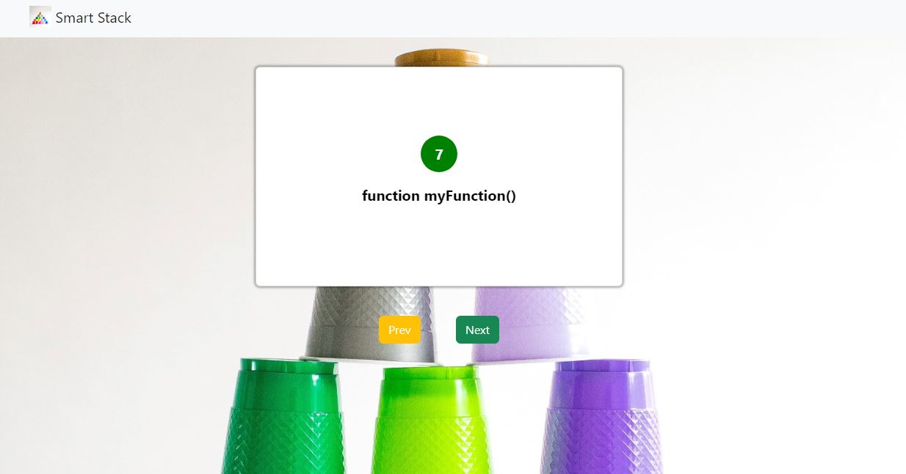

# Smart-Stack

We want Smart Cards to be the go to web application for anyone who is looking to ace their technical coding interview. We are looking to design an interactive &amp; easy to use user interface where the user can pick which topic they want to learn about and they will be presented with popular interview questions for that topic

## Languages & tools

- [Node](https://nodejs.org/en/)

- [Express](https://expressjs.com/)

- [Mongoose](https://mongoosejs.com/)

- [React](https://reactjs.org/)

- [Webpack](https://webpack.js.org/) 

**Deployed On:**

## Application Screenshot

;
;